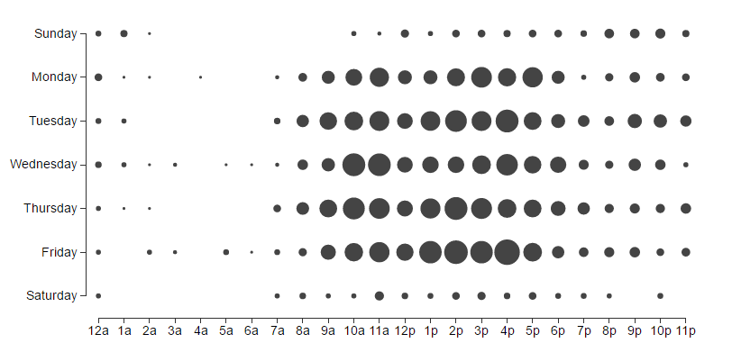

# d3-punchcard

Punchcard with [D3.js](https://d3js.org/).



### Install

```sh
$ npm install d3-punchcard
```

### Usage

```html
<!DOCTYPE html>
<html lang="en">
<head>
  <meta charset="UTF-8">
  <title>Document</title>
  <script src="d3-punchcard.min.js"></script>
</head>
<body>
  <div id="example"></div>
</body>
</html>
```

```javascript
var chart = punchcard({
  target: '#example'
});

chart.render([
  [0, 0, 4],
  [0, 1, 6],
  [0, 2, 1],
  [0, 3, 0],
  // ... ...
])
```

### API

- `punchcard(options)`
- `chart.render(data)`
- `chart.clear()`

### License

[MIT](./LICENSE)
